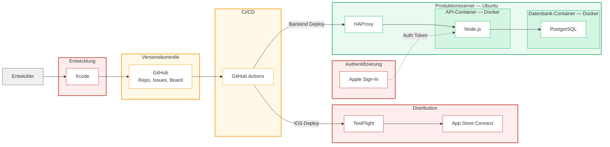

# Verwendete Infrastruktur und Lock-in-Analyse

## Infrastruktur-Übersicht

Die folgende Tabelle zeigt alle Software-Komponenten, die im Sidequest-Projekt eingesetzt werden, mit Klassifikation und Bewertung des Lock-in-Risikos.

| Komponente | Typ | Lizenz | Lock-in-Risiko | Begründung |
|-----------|-----|--------|---------------|------------|
| **Node.js** | Open-Source | MIT | Gering | Weit verbreitete Runtime, Code ist portabel auf jede Plattform |
| **PostgreSQL** | Open-Source | PostgreSQL License (BSD-ähnlich) | Gering | Standard-SQL, Daten lassen sich leicht exportieren und in andere SQL-Datenbanken importieren |
| **Docker** | Open-Source (Engine) | Apache 2.0 | Gering | Container-Images sind standardisiert (OCI), laufen auf jeder Container-Runtime (Podman, containerd) |
| **HAProxy** | Open-Source | GPL v2 | Gering | Konfiguration ist einfach, Wechsel zu Nginx oder Caddy jederzeit möglich |
| **Ubuntu Server** | Open-Source | GPL/diverse | Gering | Standard-Linux, Migration zu Debian, RHEL oder anderen Distributionen mit wenig Aufwand möglich |
| **Git** | Open-Source | GPL v2 | Gering | Dezentrales System, jeder Klon enthält die gesamte History |
| **Swift / SwiftUI** | Open-Source (Sprache) / Proprietär (Framework) | Apache 2.0 / Proprietär | **Hoch** | Swift selbst ist Open-Source, aber SwiftUI ist ein proprietäres Apple-Framework. Die gesamte iOS-App ist an das Apple-Ökosystem gebunden. |
| **Xcode** | Proprietär | Apple EULA | **Hoch** | Einzige IDE für iOS-Entwicklung. Keine Alternative. |
| **Apple Developer Program** | Proprietär | Apple Vertrag | **Hoch** | Ohne die jährliche Mitgliedschaft (99 €/Jahr) kann keine App im App Store veröffentlicht werden |
| **App Store Connect / TestFlight** | Proprietär | Apple Vertrag | **Hoch** | Einziger Distributionskanal für iOS-Apps (bis auf Sideloading in der EU seit DMA) |
| **GitHub** | Proprietär (Microsoft) | ToS | Mittel | Repository lässt sich dank Git leicht zu GitLab, Bitbucket oder Self-Hosted migrieren. Aber: GitHub Actions Workflows, Issue Templates und Project Boards sind nicht portabel. |
| **GitHub Actions** | Proprietär (Microsoft) | ToS | Mittel | Workflow-Syntax ist GitHub-spezifisch. Migration zu GitLab CI, Jenkins oder CircleCI erfordert Umschreiben der Workflows. Die zugrundeliegenden Konzepte (YAML, Steps, Jobs) sind aber ähnlich. |
| **Strato vServer** | Proprietär (Hosting) | Strato AGB | Gering | Standard-Linux-Server. Migration zu jedem anderen Hoster (Hetzner, DigitalOcean, AWS) durch erneutes Aufsetzen des Servers möglich. Keine proprietären APIs. |
| **Apple Sign-In** | Proprietär | Apple Vertrag | Mittel | Für iOS-Apps mit Social Login von Apple vorgeschrieben. Nutzer-Identifikation ist an Apple-IDs gebunden. Ergänzung um andere Auth-Provider (Google, E-Mail) wäre aber möglich. |

## Lock-in-Bewertung nach Kategorie

### Kein/Geringes Lock-in (grün)

**Backend-Stack: Node.js + PostgreSQL + Docker + HAProxy + Ubuntu**

Der gesamte Backend-Stack besteht aus Open-Source-Komponenten mit offenen Standards. Die REST-API kommuniziert über HTTP/JSON -- ein universelles Protokoll, das von jeder Client-Technologie konsumiert werden kann. Die PostgreSQL-Datenbank nutzt Standard-SQL und kann über `pg_dump` vollständig exportiert werden. Docker-Container sind OCI-kompatibel und laufen auf jeder Container-Runtime. Ein Wechsel des Hosters oder einzelner Komponenten wäre mit überschaubarem Aufwand möglich.

### Mittleres Lock-in (gelb)

**GitHub-Ökosystem: Repository + Actions + Project Board**

Das Git-Repository selbst ist dank der dezentralen Natur von Git jederzeit migrierbar -- jeder Klon enthält die vollständige History. Die **GitHub-spezifischen Features** sind jedoch nicht portabel:
- GitHub Actions Workflows (`.github/workflows/*.yml`) müssten für einen anderen CI/CD-Anbieter neu geschrieben werden
- GitHub Issue Templates, Labels und das Project Board haben kein standardisiertes Exportformat
- Pull Request History und Kommentare gehen bei einer Migration verloren

**Apple Sign-In** ist für iOS-Apps mit Social Login vorgeschrieben (App Store Review Guideline 4.8). Die Nutzer-Identität ist an die Apple-ID gebunden. Eine Ergänzung um E-Mail/Passwort oder andere OAuth-Provider würde das Lock-in reduzieren.

### Hohes Lock-in (rot)

**Apple-Ökosystem: Swift/SwiftUI + Xcode + App Store + TestFlight**

Dies ist der gravierendste Lock-in im Projekt. Die gesamte iOS-App (ca. 7.400 Zeilen Swift/SwiftUI) ist **ausschließlich auf Apple-Plattformen lauffähig**. Eine Portierung auf Android würde eine komplette Neuentwicklung erfordern (z.B. in Kotlin/Jetpack Compose). Dieser Lock-in ist bei nativer iOS-Entwicklung unvermeidbar und wurde bewusst in Kauf genommen, weil:

1. **Performance und UX**: Native Apps bieten die beste User Experience und Performance auf der Zielplattform
2. **Apple-Framework-Integration**: MapKit, CoreLocation, APNs und Apple Sign-In sind tief in die App integriert
3. **Projektumfang**: Für ein Schulprojekt mit begrenzter Laufzeit ist eine plattformübergreifende Lösung (React Native, Flutter) ein zusätzlicher Komplexitätsfaktor, der den Fokus vom eigentlichen Produkt ablenkt
4. **Zielgruppe**: Die primäre Zielgruppe nutzt überwiegend iPhones

## Infrastruktur-Diagramm

**Legende:** Rot = proprietär, hohes Lock-in | Gelb = proprietär, mittleres Lock-in | Grün = Open-Source, geringes Lock-in
