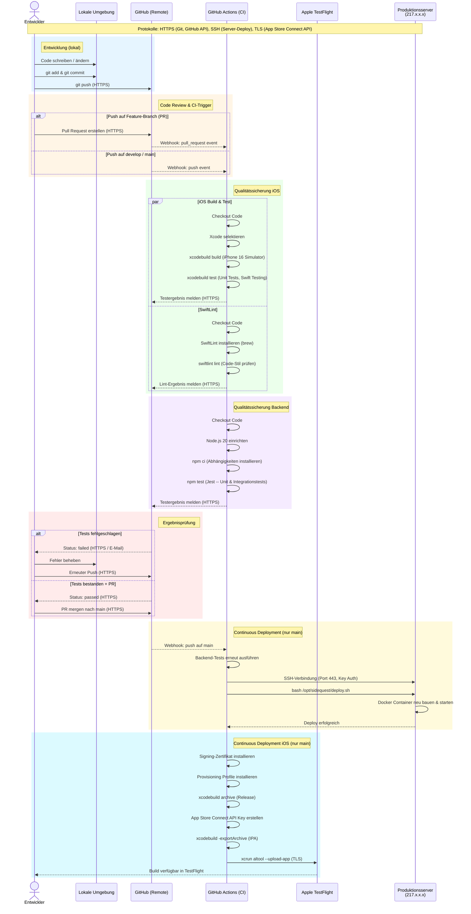

# Sequenzdiagramm: Continuous-Delivery-Pipeline

## Gesamtübersicht

Das Diagramm zeigt den vollständigen Weg eines Commits von der lokalen Entwicklungsumgebung durch CI (Qualitätssicherung) bis zum Deployment in die Produktivumgebung -- für iOS und Backend.

## Verwendete Protokolle

| Protokoll | Einsatzort | Zweck |
|-----------|-----------|-------|
| **HTTPS** | Git Push/Pull, GitHub API, Webhooks | Quellcode-Transfer, CI-Trigger, Statusmeldungen |
| **SSH** (Port 443) | Backend-Deployment | Sichere Verbindung zum Produktionsserver, Key-basierte Authentifizierung |
| **TLS** | App Store Connect API | Upload der IPA-Datei zu TestFlight (altool + API Key) |

## Qualitätssicherungsmaßnahmen in der Pipeline

| Nr. | Maßnahme | Typ | Automatisiert |
|-----|----------|-----|---------------|
| 1 | **Unit Tests (iOS)** | Swift Testing Framework | Ja (CI) |
| 2 | **Unit & Integrationstests (Backend)** | Jest | Ja (CI) |
| 3 | **SwiftLint** | Statische Code-Analyse | Ja (CI) |
| 4 | **Issue Templates** | Strukturierte Bug-/Feature-Reports | Ja (GitHub) |
| 5 | **Branch-Strategie** | main / develop / feature/* | Organisatorisch |
| 6 | **Code Review** | Pull Requests vor Merge | Organisatorisch |
