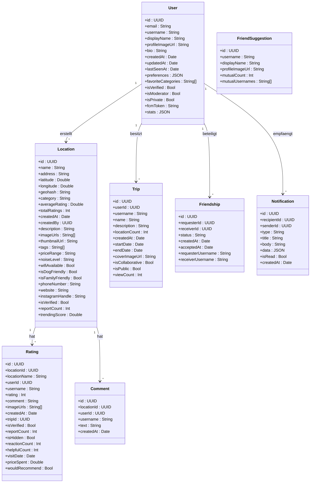
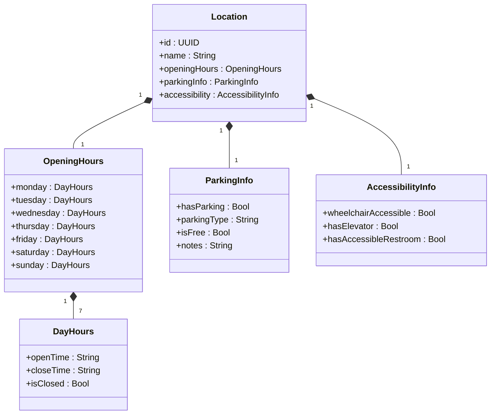
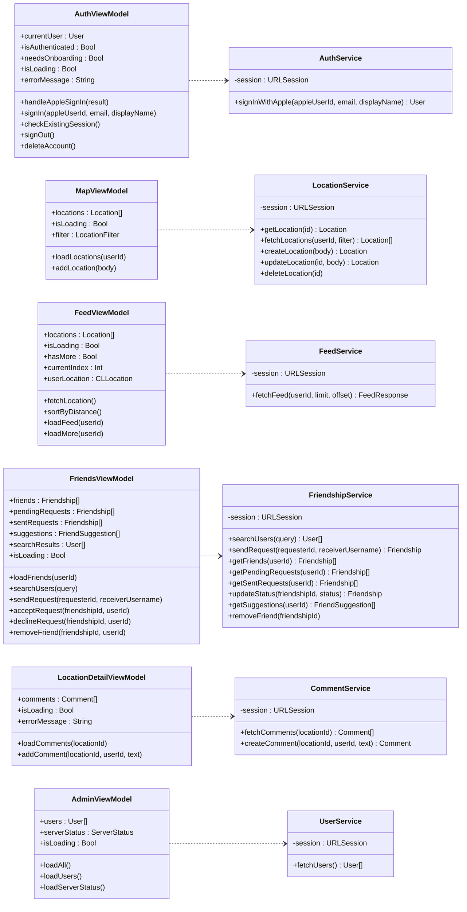
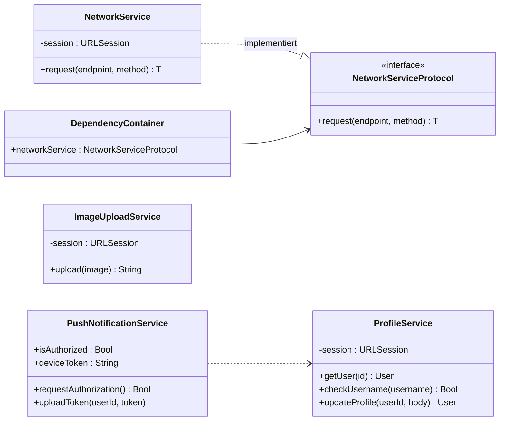
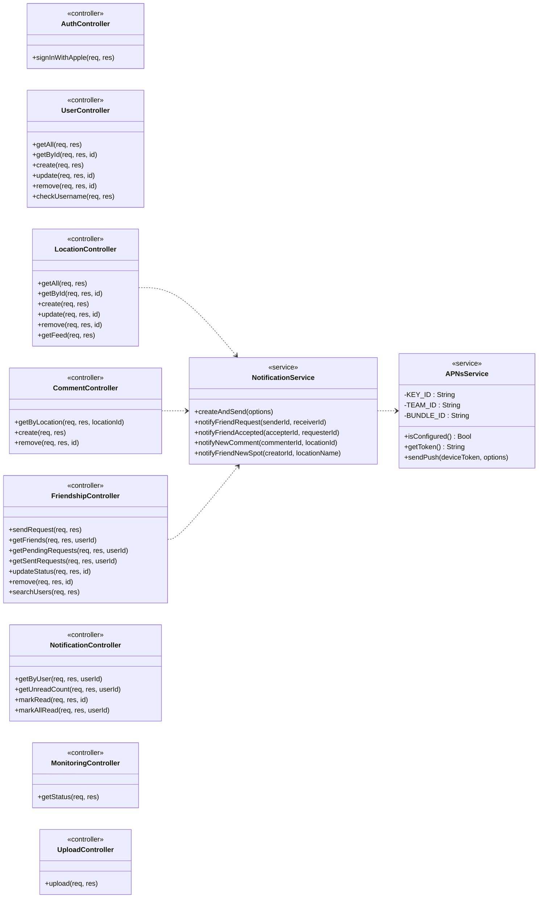
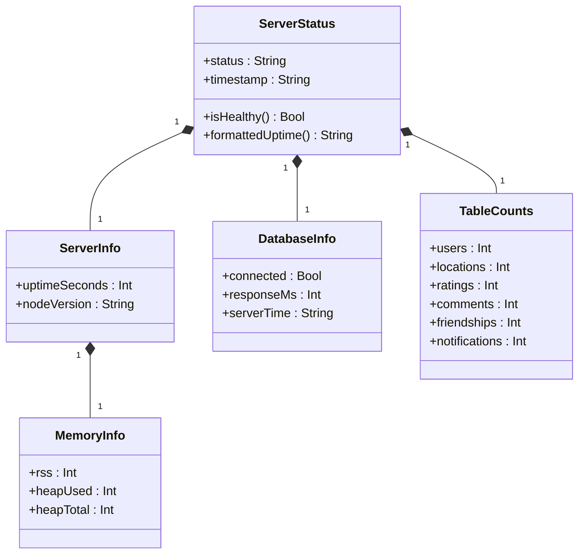
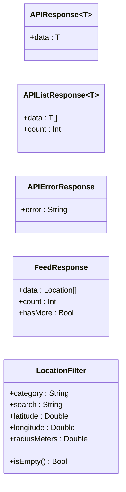

# Klassendiagramm - Sidequest

## 1. Kern-Datenmodell

## 2. Location-Komposition

## 3. iOS-Architektur (ViewModels und Services)

## 4. Weitere iOS-Services

## 5. Backend-Architektur (Controller und Services)

## 6. Monitoring-Struktur

## 7. API-Antworttypen

