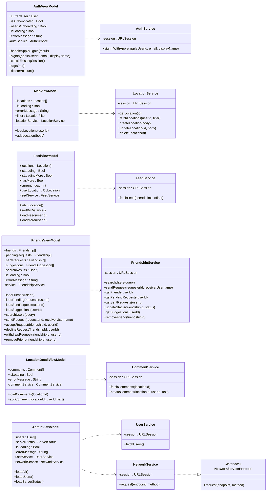
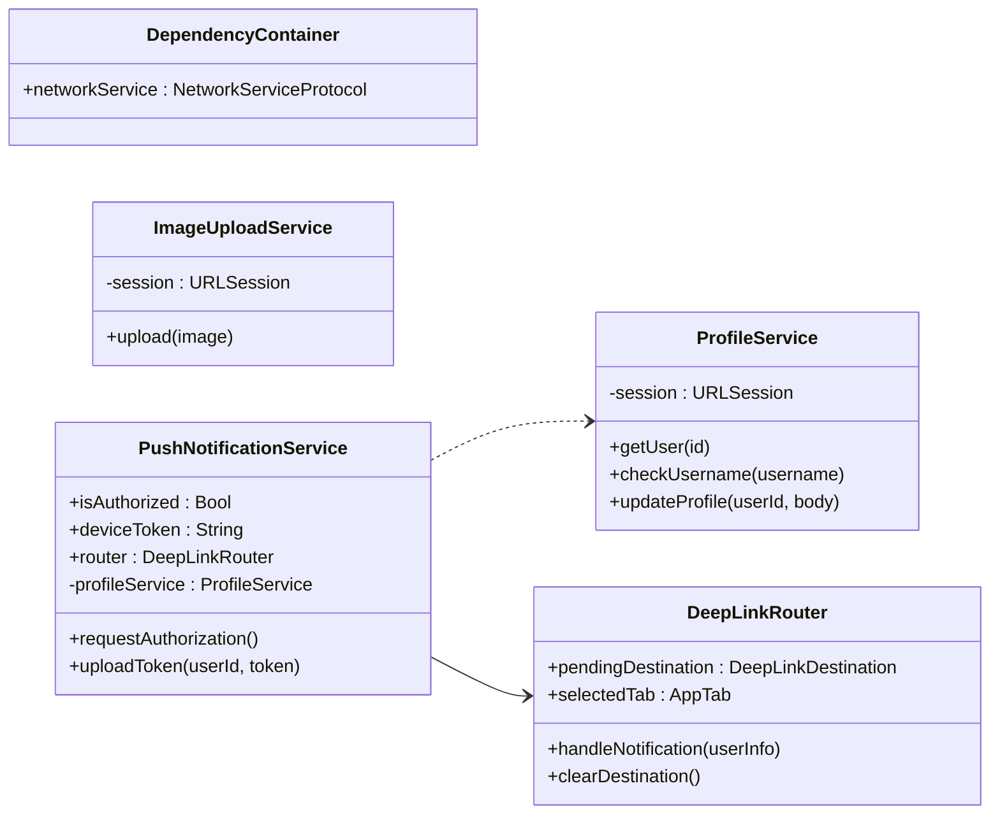
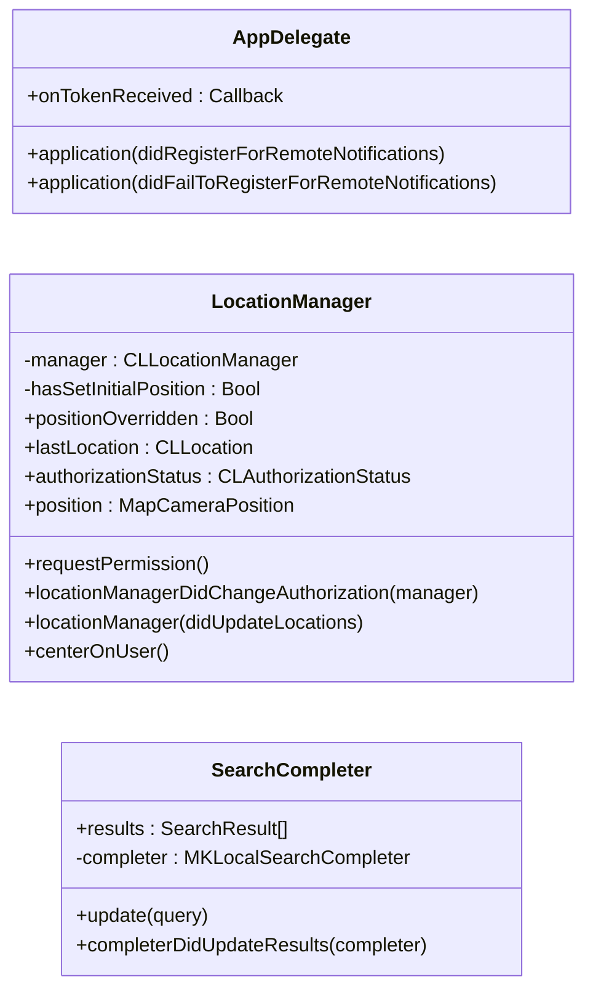

# Klassendiagramm - Sidequest

## 1. ViewModels und ihre Services

```mermaid
classDiagram
    direction LR

    class AuthViewModel {
        +currentUser : User
        +isAuthenticated : Bool
        +needsOnboarding : Bool
        +isLoading : Bool
        +errorMessage : String
        -authService : AuthService
        +handleAppleSignIn(result)
        +signIn(appleUserId, email, displayName)
        +checkExistingSession()
        +signOut()
        +deleteAccount()
    }

    class AuthService {
        -session : URLSession
        +signInWithApple(appleUserId, email, displayName)
    }

    class MapViewModel {
        +locations : Location[]
        +isLoading : Bool
        +errorMessage : String
        +filter : LocationFilter
        -locationService : LocationService
        +loadLocations(userId)
        +addLocation(body)
    }

    class LocationService {
        -session : URLSession
        +getLocation(id)
        +fetchLocations(userId, filter)
        +createLocation(body)
        +updateLocation(id, body)
        +deleteLocation(id)
    }

    class FeedViewModel {
        +locations : Location[]
        +isLoading : Bool
        +isLoadingMore : Bool
        +hasMore : Bool
        +currentIndex : Int
        +userLocation : CLLocation
        -feedService : FeedService
        +fetchLocation()
        +sortByDistance()
        +loadFeed(userId)
        +loadMore(userId)
    }

    class FeedService {
        -session : URLSession
        +fetchFeed(userId, limit, offset)
    }

    class FriendsViewModel {
        +friends : Friendship[]
        +pendingRequests : Friendship[]
        +sentRequests : Friendship[]
        +suggestions : FriendSuggestion[]
        +searchResults : User[]
        +isLoading : Bool
        +errorMessage : String
        -service : FriendshipService
        +loadFriends(userId)
        +loadPendingRequests(userId)
        +loadSentRequests(userId)
        +loadSuggestions(userId)
        +searchUsers(query)
        +sendRequest(requesterId, receiverUsername)
        +acceptRequest(friendshipId, userId)
        +declineRequest(friendshipId, userId)
        +withdrawRequest(friendshipId, userId)
        +removeFriend(friendshipId, userId)
    }

    class FriendshipService {
        -session : URLSession
        +searchUsers(query)
        +sendRequest(requesterId, receiverUsername)
        +getFriends(userId)
        +getPendingRequests(userId)
        +getSentRequests(userId)
        +updateStatus(friendshipId, status)
        +getSuggestions(userId)
        +removeFriend(friendshipId)
    }

    class LocationDetailViewModel {
        +comments : Comment[]
        +isLoading : Bool
        +errorMessage : String
        -commentService : CommentService
        +loadComments(locationId)
        +addComment(locationId, userId, text)
    }

    class CommentService {
        -session : URLSession
        +fetchComments(locationId)
        +createComment(locationId, userId, text)
    }

    class AdminViewModel {
        +users : User[]
        +serverStatus : ServerStatus
        +isLoading : Bool
        +errorMessage : String
        -userService : UserService
        -networkService : NetworkService
        +loadAll()
        +loadUsers()
        +loadServerStatus()
    }

    class UserService {
        -session : URLSession
        +fetchUsers()
    }

    class NetworkService {
        -session : URLSession
        +request(endpoint, method)
    }

    class NetworkServiceProtocol {
        <<interface>>
        +request(endpoint, method)
    }

    AuthViewModel ..> AuthService
    MapViewModel ..> LocationService
    FeedViewModel ..> FeedService
    FriendsViewModel ..> FriendshipService
    LocationDetailViewModel ..> CommentService
    AdminViewModel ..> UserService
    AdminViewModel ..> NetworkService
    NetworkService ..|> NetworkServiceProtocol
```

## 2. Infrastruktur-Services

```mermaid
classDiagram
    direction LR

    class DependencyContainer {
        +networkService : NetworkServiceProtocol
    }

    class ProfileService {
        -session : URLSession
        +getUser(id)
        +checkUsername(username)
        +updateProfile(userId, body)
    }

    class ImageUploadService {
        -session : URLSession
        +upload(image)
    }

    class PushNotificationService {
        +isAuthorized : Bool
        +deviceToken : String
        +router : DeepLinkRouter
        -profileService : ProfileService
        +requestAuthorization()
        +uploadToken(userId, token)
    }

    class DeepLinkRouter {
        +pendingDestination : DeepLinkDestination
        +selectedTab : AppTab
        +handleNotification(userInfo)
        +clearDestination()
    }

    PushNotificationService ..> ProfileService
    PushNotificationService --> DeepLinkRouter
```

## 3. Utilities und App-Lifecycle

```mermaid
classDiagram
    direction LR

    class AppDelegate {
        +onTokenReceived : Callback
        +application(didRegisterForRemoteNotifications)
        +application(didFailToRegisterForRemoteNotifications)
    }

    class LocationManager {
        -manager : CLLocationManager
        -hasSetInitialPosition : Bool
        +positionOverridden : Bool
        +lastLocation : CLLocation
        +authorizationStatus : CLAuthorizationStatus
        +position : MapCameraPosition
        +requestPermission()
        +locationManagerDidChangeAuthorization(manager)
        +locationManager(didUpdateLocations)
        +centerOnUser()
    }

    class SearchCompleter {
        +results : SearchResult[]
        -completer : MKLocalSearchCompleter
        +update(query)
        +completerDidUpdateResults(completer)
    }
```
