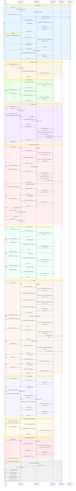

# Sequenzdiagramm - Sidequest

```mermaid
sequenceDiagram
    actor B as Benutzer
    participant App as iOS App
    participant API as Backend API
    participant DB as PostgreSQL
    participant APNs as Apple Push
    participant Apple as Apple ID

    %% ═══════════════════════════════════════
    %% 1. APP-START & AUTHENTIFIZIERUNG
    %% ═══════════════════════════════════════
    rect rgb(230, 245, 255)
        note over B, Apple: 1 – Authentifizierung

        B ->> App: App oeffnen
        App ->> App: Gespeicherte Session pruefen

        alt Keine Session vorhanden
            B ->> App: Mit Apple anmelden tippen
            App ->> Apple: ASAuthorization Request
            Apple -->> App: Apple User ID, E-Mail, Name
            App ->> API: POST /api/auth/apple
            API ->> DB: SELECT user WHERE apple_user_id
            alt Neuer Benutzer
                DB -->> API: Nicht gefunden
                API ->> DB: INSERT INTO users
                DB -->> API: User-Objekt
                API -->> App: user, isNewUser true
                note over B, App: Onboarding
                B ->> App: Username und Anzeigename eingeben
                App ->> API: PUT /api/users/{id}
                API ->> DB: UPDATE users SET username, display_name
                DB -->> API: Aktualisierter User
                API -->> App: User-Objekt
            else Bestehender Benutzer
                DB -->> API: User-Objekt
                API -->> App: user, isNewUser false
            end
        else Session vorhanden
            App ->> API: POST /api/auth/apple mit gespeicherter ID
            API ->> DB: SELECT user
            DB -->> API: User-Objekt
            API -->> App: User-Objekt
        end
    end

    %% ═══════════════════════════════════════
    %% 2. PUSH-TOKEN REGISTRIEREN
    %% ═══════════════════════════════════════
    rect rgb(255, 245, 230)
        note over B, APNs: 2 – Push-Token registrieren

        App ->> B: Push-Berechtigung anfragen
        B -->> App: Erlaubt
        App ->> App: Device Token empfangen
        App ->> API: POST /api/users/{id}/notifications/token
        API ->> DB: UPDATE users SET fcm_token
        DB -->> API: OK
        API -->> App: Bestaetigung
    end

    %% ═══════════════════════════════════════
    %% 3. HOME-FEED
    %% ═══════════════════════════════════════
    rect rgb(235, 255, 235)
        note over B, DB: 3 – Home-Feed laden

        App ->> API: GET /api/feed?userId&limit=200
        API ->> DB: SELECT locations von Freunden, sortiert
        DB -->> API: Location-Liste
        API -->> App: data, count, hasMore
        App ->> B: Feed-Karussell anzeigen

        opt Weitere Locations laden (Pagination)
            B ->> App: Zum Ende scrollen
            App ->> API: GET /api/feed?offset=200
            API ->> DB: SELECT locations OFFSET 200
            DB -->> API: Weitere Locations
            API -->> App: data, hasMore false
        end
    end

    %% ═══════════════════════════════════════
    %% 4. LOCATION ERSTELLEN
    %% ═══════════════════════════════════════
    rect rgb(245, 235, 255)
        note over B, APNs: 4 – Location erstellen

        B ->> App: Plus-Button tippen
        B ->> App: Ort suchen
        App ->> App: MKLocalSearch Anfrage
        App -->> B: Suchergebnisse anzeigen
        B ->> App: Ort, Kategorie, Beschreibung, Fotos waehlen

        loop Fuer jedes Foto
            App ->> API: POST /api/uploads (Base64)
            API ->> API: Komprimieren, max 1200px JPEG
            API -->> App: image URL
        end

        App ->> API: POST /api/locations
        API ->> DB: INSERT INTO locations
        DB -->> API: Location-Objekt
        API ->> DB: SELECT friends WHERE status accepted
        DB -->> API: Freunde mit fcm_token
        API ->> APNs: Push an alle Freunde
        APNs -->> API: Zustellbestaetigung
        API -->> App: Location-Objekt
        App ->> B: Erfolg anzeigen
    end

    %% ═══════════════════════════════════════
    %% 5. LOCATION-DETAILS & KOMMENTARE
    %% ═══════════════════════════════════════
    rect rgb(255, 240, 240)
        note over B, APNs: 5 – Location-Details und Kommentare

        B ->> App: Location antippen
        par Parallel laden
            App ->> API: GET /api/locations/{id}
            API ->> DB: SELECT location JOIN users (Creator)
            DB -->> API: Location mit Creator-Info
        and
            App ->> API: GET /api/locations/{id}/comments
            API ->> DB: SELECT comments ORDER BY created_at
            DB -->> API: Kommentar-Liste
        end
        API -->> App: Location + Kommentare
        App ->> B: Detail-Ansicht anzeigen

        opt Kommentar schreiben
            B ->> App: Text eingeben und senden
            App ->> API: POST /api/comments
            API ->> DB: INSERT INTO comments
            DB -->> API: Kommentar-Objekt
            API ->> DB: SELECT location.created_by
            DB -->> API: Ersteller-ID und fcm_token
            API ->> APNs: Push an Location-Ersteller
            API -->> App: Kommentar-Objekt
        end

        opt Eigene Location bearbeiten
            B ->> App: Kategorie oder Beschreibung aendern
            App ->> API: PUT /api/locations/{id}
            API ->> DB: UPDATE locations
            DB -->> API: Aktualisierte Location
            API -->> App: Location-Objekt
        end

        opt Location loeschen
            B ->> App: Loeschen bestaetigen
            App ->> API: DELETE /api/locations/{id}
            API ->> DB: DELETE FROM locations
            DB -->> API: OK
            API -->> App: Bestaetigung
        end

        opt Route berechnen
            B ->> App: Route-Button tippen
            App ->> App: Apple Maps oeffnen mit Koordinaten
        end

        opt Location teilen
            B ->> App: Teilen-Button tippen
            App ->> App: iOS Share Sheet oeffnen
        end
    end

    %% ═══════════════════════════════════════
    %% 6. KARTE & FILTER
    %% ═══════════════════════════════════════
    rect rgb(240, 255, 250)
        note over B, DB: 6 – Karte und Filter

        B ->> App: Karte-Tab oeffnen
        App ->> API: GET /api/locations?userId
        API ->> DB: SELECT eigene + Freunde-Locations
        DB -->> API: Location-Liste
        API -->> App: Locations
        App ->> B: Pins auf Karte anzeigen

        opt Nach Kategorie filtern
            B ->> App: Kategorie waehlen
            App ->> API: GET /api/locations?category=restaurant
            API ->> DB: SELECT WHERE category
            DB -->> API: Gefilterte Locations
            API -->> App: Locations
            App ->> B: Gefilterte Pins anzeigen
        end

        opt Umkreissuche
            B ->> App: Radius waehlen (z.B. 5km)
            App ->> API: GET /api/locations?lat&lng&radius=5000
            API ->> DB: SELECT WHERE ST_Distance
            DB -->> API: Locations im Umkreis
            API -->> App: Locations
            App ->> B: Pins im Umkreis anzeigen
        end

        opt Nach Name suchen
            B ->> App: Suchbegriff eingeben
            App ->> API: GET /api/locations?search=text
            API ->> DB: SELECT WHERE name ILIKE
            DB -->> API: Treffer
            API -->> App: Locations
        end
    end

    %% ═══════════════════════════════════════
    %% 7. FREUNDSCHAFTSVERWALTUNG
    %% ═══════════════════════════════════════
    rect rgb(255, 245, 240)
        note over B, APNs: 7 – Freunde

        B ->> App: Freunde-Tab oeffnen
        par Parallel laden
            App ->> API: GET /api/friends/{userId}
            API ->> DB: SELECT friendships WHERE accepted
            DB -->> API: Freunde-Liste
        and
            App ->> API: GET /api/friendships/pending/{userId}
            API ->> DB: SELECT friendships WHERE pending, receiver
            DB -->> API: Eingehende Anfragen
        and
            App ->> API: GET /api/friendships/sent/{userId}
            API ->> DB: SELECT friendships WHERE pending, requester
            DB -->> API: Gesendete Anfragen
        and
            App ->> API: GET /api/friends/{userId}/suggestions
            API ->> DB: Friend-of-Friend Query
            DB -->> API: Vorschlaege
        end
        API -->> App: Alle Freundschaftsdaten
        App ->> B: Freunde-Ansicht anzeigen

        opt Nutzer suchen und Anfrage senden
            B ->> App: Username eingeben (mind. 2 Zeichen)
            App ->> API: GET /api/users/search?q=username
            API ->> DB: SELECT users WHERE username ILIKE
            DB -->> API: Suchergebnisse
            API -->> App: User-Liste
            B ->> App: Anfrage senden tippen
            App ->> API: POST /api/friendships
            API ->> DB: INSERT INTO friendships (status pending)
            DB -->> API: Friendship-Objekt
            API ->> APNs: Push an Empfaenger
            APNs -->> API: Zugestellt
            API -->> App: Bestaetigung
        end

        opt Anfrage annehmen
            B ->> App: Annehmen tippen
            App ->> API: PATCH /api/friendships/{id}
            API ->> DB: UPDATE SET status accepted, accepted_at
            DB -->> API: Friendship
            API ->> APNs: Push an Anfragenden
            API -->> App: Bestaetigung
        end

        opt Anfrage ablehnen
            B ->> App: Ablehnen tippen
            App ->> API: PATCH /api/friendships/{id}
            API ->> DB: UPDATE SET status declined
            API -->> App: Bestaetigung
        end

        opt Freund entfernen
            B ->> App: Freund loeschen
            App ->> API: DELETE /api/friendships/{id}
            API ->> DB: DELETE FROM friendships
            API -->> App: Bestaetigung
        end
    end

    %% ═══════════════════════════════════════
    %% 8. PROFILVERWALTUNG
    %% ═══════════════════════════════════════
    rect rgb(245, 245, 255)
        note over B, DB: 8 – Profilverwaltung

        B ->> App: Eigenes Profil oeffnen
        App ->> API: GET /api/users/{id}
        API ->> DB: SELECT user
        DB -->> API: User-Objekt
        API -->> App: User-Objekt

        opt Profil bearbeiten
            B ->> App: Name, Username oder Bio aendern

            opt Profilbild aendern
                B ->> App: Foto aufnehmen oder aus Galerie waehlen
                App ->> API: POST /api/uploads (Base64)
                API -->> App: image URL
            end

            opt Username pruefen
                App ->> API: GET /api/users/check-username?username=neu
                API ->> DB: SELECT WHERE username
                DB -->> API: Verfuegbar ja/nein
                API -->> App: available true/false
            end

            App ->> API: PUT /api/users/{id}
            API ->> DB: UPDATE users
            DB -->> API: Aktualisierter User
            API -->> App: User-Objekt
        end
    end

    %% ═══════════════════════════════════════
    %% 9. BENACHRICHTIGUNGS-EINSTELLUNGEN
    %% ═══════════════════════════════════════
    rect rgb(255, 250, 235)
        note over B, DB: 9 – Benachrichtigungs-Einstellungen

        B ->> App: Einstellungen, Mitteilungen oeffnen
        App ->> B: Aktuelle Einstellungen anzeigen

        opt Benachrichtigungstypen aendern
            B ->> App: Typen an/aus schalten
            App ->> API: PUT /api/users/{id} (preferences JSON)
            API ->> DB: UPDATE users SET preferences
            DB -->> API: OK
            API -->> App: Bestaetigung
        end
    end

    %% ═══════════════════════════════════════
    %% 10. ADMINISTRATION
    %% ═══════════════════════════════════════
    rect rgb(255, 235, 235)
        note over B, DB: 10 – Administration (nur Moderatoren)

        B ->> App: Admin-Tab oeffnen
        par Parallel laden
            App ->> API: GET /api/admin/monitoring
            API ->> DB: Health Check, SELECT count je Tabelle
            DB -->> API: Status, Uptime, Tabellen-Zaehler
        and
            App ->> API: GET /api/users
            API ->> DB: SELECT alle Users
            DB -->> API: User-Liste
        end
        API -->> App: Monitoring-Daten + User-Liste
        App ->> B: Admin-Dashboard anzeigen
    end

    %% ═══════════════════════════════════════
    %% 11. DEEP LINKS
    %% ═══════════════════════════════════════
    rect rgb(240, 240, 240)
        note over B, App: 11 – Deep Links und Push-Navigation

        opt Push-Benachrichtigung angetippt
            APNs -->> App: Notification Payload
            App ->> App: DeepLinkRouter verarbeitet Typ
            alt Freundschaftsanfrage
                App ->> B: Freunde-Tab oeffnen
            else Neuer Kommentar
                App ->> B: Location-Detail oeffnen
            else Neuer Spot von Freund
                App ->> B: Location-Detail oeffnen
            end
        end
    end
```
