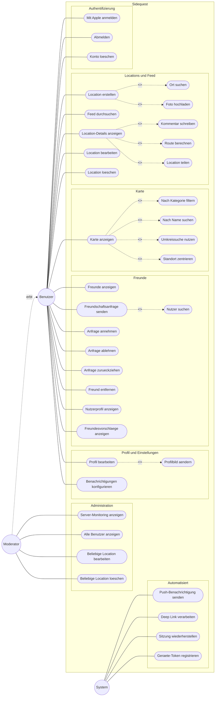

# Use-Case-Diagramm - Sidequest

```mermaid
graph LR
    %% ══════ Akteure ══════
    B((Benutzer))
    M((Moderator))
    S((System))

    M -. erbt .-> B

    %% ══════ Systemgrenze ══════
    subgraph SQ ["Sidequest"]
        direction TB

        subgraph G1 ["Authentifizierung"]
            A1([Mit Apple anmelden])
            A3([Abmelden])
            A4([Konto loeschen])
        end

        subgraph G2 ["Locations und Feed"]
            L1([Location erstellen])
            L2([Ort suchen])
            L3([Foto hochladen])
            L4([Feed durchsuchen])
            L5([Location-Details anzeigen])
            L6([Kommentar schreiben])
            L7([Location bearbeiten])
            L8([Location loeschen])
            L9([Route berechnen])
            L10([Location teilen])
            L1 -. <<includes>> .-> L2
            L1 -. <<includes>> .-> L3
            L5 -. <<extends>> .-> L6
            L5 -. <<extends>> .-> L9
            L5 -. <<extends>> .-> L10
        end

        subgraph G3 ["Karte"]
            K1([Karte anzeigen])
            K2([Nach Kategorie filtern])
            K3([Nach Name suchen])
            K4([Umkreissuche nutzen])
            K5([Standort zentrieren])
            K1 -. <<extends>> .-> K2
            K1 -. <<extends>> .-> K3
            K1 -. <<extends>> .-> K4
            K1 -. <<extends>> .-> K5
        end

        subgraph G4 ["Freunde"]
            F1([Freunde anzeigen])
            F2([Nutzer suchen])
            F3([Freundschaftsanfrage senden])
            F4([Anfrage annehmen])
            F5([Anfrage ablehnen])
            F6([Anfrage zurueckziehen])
            F7([Freund entfernen])
            F8([Nutzerprofil anzeigen])
            F9([Freundesvorschlaege anzeigen])
            F3 -. <<includes>> .-> F2
        end

        subgraph G5 ["Profil und Einstellungen"]
            P1([Profil bearbeiten])
            P2([Profilbild aendern])
            P3([Benachrichtigungen konfigurieren])
            P1 -. <<extends>> .-> P2
        end

        subgraph G6 ["Administration"]
            AD1([Server-Monitoring anzeigen])
            AD2([Alle Benutzer anzeigen])
            AD3([Beliebige Location bearbeiten])
            AD4([Beliebige Location loeschen])
        end

        subgraph G7 ["Automatisiert"]
            SY1([Push-Benachrichtigung senden])
            SY2([Deep Link verarbeiten])
            SY3([Sitzung wiederherstellen])
            SY4([Geraete-Token registrieren])
        end
    end

    %% ══════ Benutzer-Verbindungen ══════
    B --- A1
    B --- A3
    B --- A4
    B --- L1
    B --- L4
    B --- L5
    B --- L7
    B --- L8
    B --- K1
    B --- F1
    B --- F3
    B --- F4
    B --- F5
    B --- F6
    B --- F7
    B --- F8
    B --- F9
    B --- P1
    B --- P3

    %% ══════ Moderator-Verbindungen ══════
    M --- AD1
    M --- AD2
    M --- AD3
    M --- AD4

    %% ══════ System-Verbindungen ══════
    S --- SY1
    S --- SY2
    S --- SY3
    S --- SY4
```
